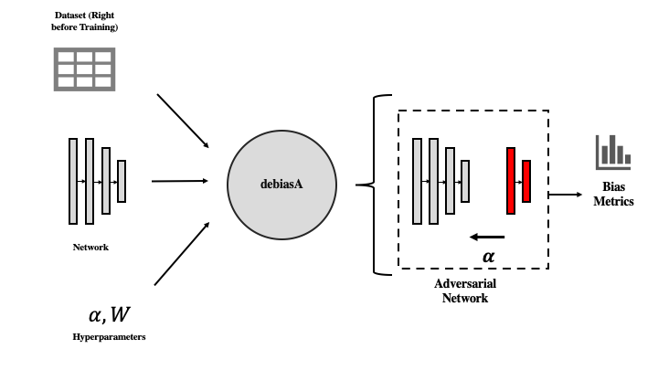

# debiasA

## About
This personal project is inspired by some of the exploratory work I performed regarding implicit bias and discrimination in deep learning models. That can be found here: github.com/bg459/debias.

**debiasA** seeks to automate the process of reducing bias that is often inherent in a typical deep learning model. The goal is to simplify the steps needed to create fair and objective models. Given as input a neural network pipeline, viz. the model structure, processed train/test data, hyperparameters, optimizer, debiasA will create a adversarial network pipeline that influences training of the given model.

## Problem Statement
It is well known that the classical deep learning model is subject to discrimination and implicit biases, e.g. in contexts such as loan defaults, criminal recidivism, etc. Active steps must be taken to curtail this tendency and metrics should be created to measure the extent that this treatment is occurring.

## Proposed Solution


The proposed solution is to modify the given neural network by appending an adversarial network which targets the class of interest.

For example, consider a network which uses several features about an individual to predict income. This might show up in a loan default prediction task. If one wishes to diagnose possible bias in the "race" feature in this prediction, the adversarial network will seek to predict race based on the predicted income. If the predicted income is a good predictor of race, then the network sends an adversarial signal back to the network, since income is not supposed to be a good predictor of race, in theory (especially if race is not even a feature to begin with!).

In this way, the loss function of the entire network $L'$ can expressed in terms of the loss of the original network $L$ and the adversarial loss $L_A$:
```math
L' := L - \alpha L_A
```
because the function wishes to punish accurate prediction of race given income, which would mean a low $L_A$.


## Usage
